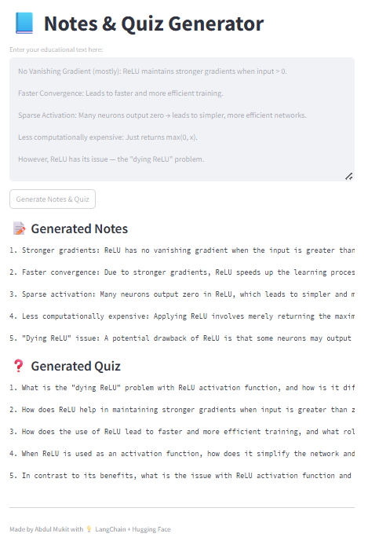

# QuickLearnAI

# 📘 Notes & Quiz Generator App

This is a simple and interactive Streamlit web application that allows users to generate concise notes and short quiz questions from any educational content. Powered by LangChain and Hugging Face's `zephyr-7b-beta` model, the app uses prompt chaining to perform NLP tasks on user-provided input text.

---

## 🚀 Features

- 📝 **Generate Notes**: Simplifies and summarizes lengthy educational text into short notes.
- ❓ **Generate Quiz**: Creates 5 relevant quiz questions based on the provided content.
- ⚡ **Fast & Efficient**: Uses Hugging Face's transformer models through LangChain for high-quality outputs.
- 💻 **Interactive UI**: Built with Streamlit, providing a clean and user-friendly interface.

---

🧩 How It Works
The app performs the following steps:

Accepts user input (any educational text).

Passes it through two prompt chains:

One for generating notes.

One for generating quiz questions.

Displays the generated content in two separate output boxes.

📸 Demo

👤 Author
Abdul Mukit

[🔗 LinkedIn]([https://www.linkedin.com/in/abdulmukitds/])

💡 Future Improvements

Export notes & quiz as PDF or text file.

Add model selection dropdown (e.g., GPT, Zephyr, Mistral).

Save user history in a database.

